# Chaos Kraken

 

An application that can be used to simulate JVM based failure scenarios when running on a delivery platform.

> Terrorise the Shipp'ng lanes with the Chaos Kraken, an incomplete FAAS (Failures as a Service).  

The first version of Chaos Kraken was created at [Auto Trader UK](https://careers.autotrader.co.uk/) back in 2017. It was originally built to test various application failure conditions on their private cloud infrastructure.

As Auto Trader started their migration to public cloud and Kubernetes, the Chaos Kraken evolved to cater for more failure modes.

Chaos Kraken is actively used within Auto Trader to verify various behaviours of their [GKE](https://cloud.google.com/kubernetes-engine) based delivery platform. 

## Usage

A [GitHub package](https://github.com/autotraderuk/chaos-kraken/packages/143034) containing the executable JAR for Chaos Kraken is created every time a new release is created using a [GitHub Actions workflow](.github/workflows/publish-release.yaml). 

Once you've downloaded the JAR file simply run it, for example:

```shell script
java -jar chaos-kraken-0.1.2.jar
```



### Start-up failures

Set the `FAIL_ON_START` environment variable to one of the failure types. 

 ```shell script
FAIL_ON_START=killapp ./gradlew clean bootRun 
```

### Runtime failures

Send a `POST` request to your desired failure e.g. 

```shell script
curl -X POST http://localhost:8080/simulate/memoryleak
```

To return a desired status code, send a `GET` request to `/echostatus/{CODE}` e.g. 

```shell script
curl http://localhost:8080/echostatus/403
```

## Failure types

- `toggle-service-health`

  Toggle application health check between healthy and unhealthy.

- `unhealthy-service`

  Toggle application health check to return unhealthy status. It will be unhealthy forever.

- `memoryleak`

  Start allocating memory until error, catch the `OutOfMemoryError`.
  
- `memoryleak-oom`

  Start allocating memory until error, uncaught `OutOfMemoryError`.

- `wastecpu`

  Start hashing random strings forever.

- `threadbomb`

  Spin up an infinite amount of threads that never end.

- `filehandlebomb`

  Start opening random new files and never closing them.

- `filecreator`

  Start creating random 1KB files in `java.io.tmpdir`.

- `stdoutbomb`

  Start repeatedly writing timestamps to `stdout`.
  
  Accepts `periodMillis` as a query parameter to set the rate (defaults to 1ms)

- `diskbomb`

  Start writing random 1GB files to random locations on disk.

- `killapp`

  Emit a log message and then immediately terminate the JVM.

- `selfconnectionsbomb`

  Start Listening on a random local port and open 5000 connections to that port

- `directmemoryleak`

  Start allocating direct memory until error.

  Accepts `limitMB` as a query parameter to set the amount of memory to leak (default is no limit, ie until OOM)

## Build


### Standalone

As the project is based on Gradle and SpringBoot, you can get started quickly by running:

```shell script
./gradlew bootRun 
```

The app will be available at http://localhost:8080

Alternatively to build an executable JAR run:

```shell script
./gradlew build
```

### Docker

A [`Dockerfile`](Dockerfile) is provided to demonstrate how you may containerise the app for deployment to a platform such as Kubernetes. 
A [`docker-compose.yaml`](docker-compose.yml) file is also provided for convenience.  

To build the image you can run:

```shell script
docker-compose build
```

To spin up the app locally run the following:

```shell script
docker-compose up
``` 

## Release

To release a new version you simply push a new tag. The Publish Release action will then build, package and publish the artifacts. 

NOTE: You'll need push access for the main repo to push the tag.
